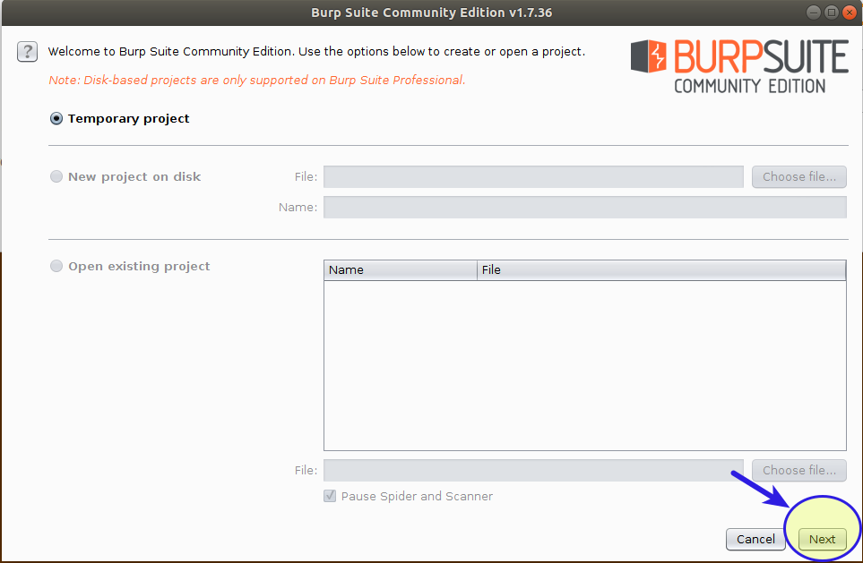
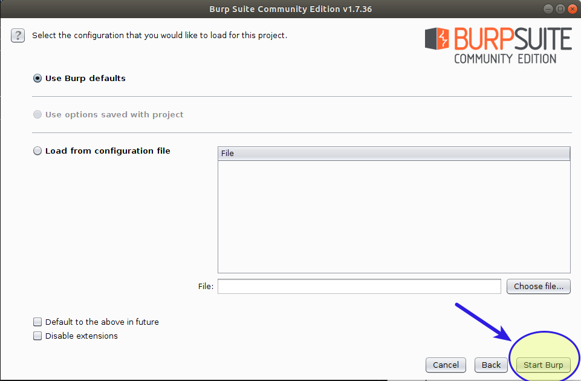
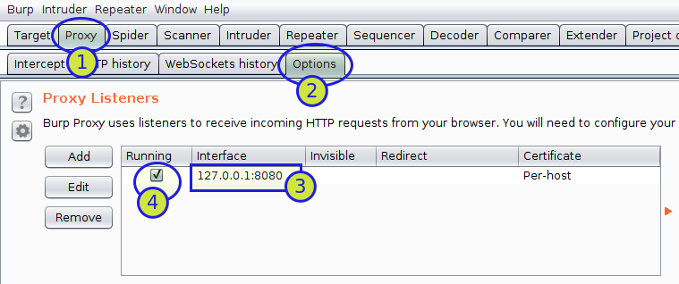
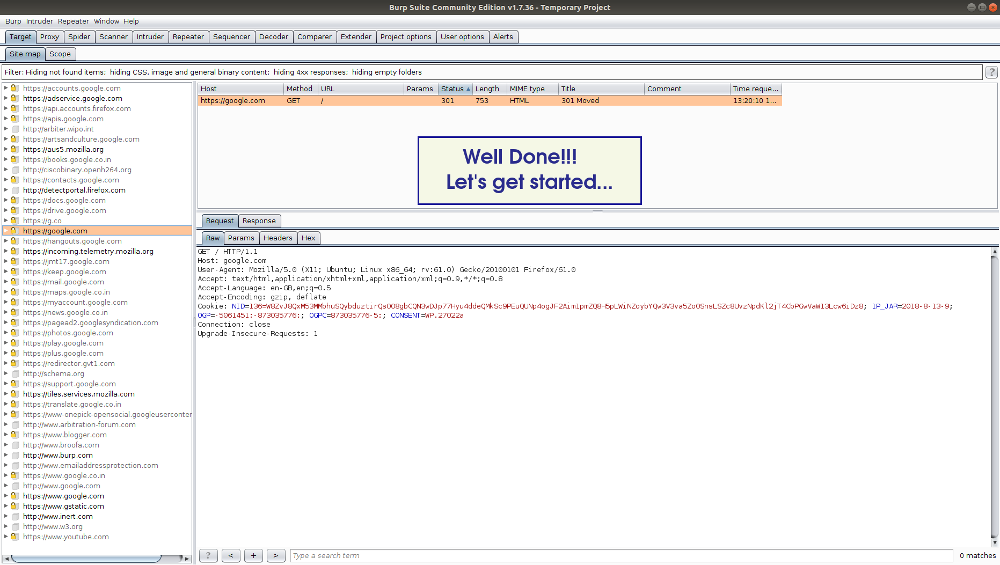

# Configuring Proxy Listener in Burp Suite

[< Back](../README.md)

1. If you have __Burp Suite__ Community Edition (https://portswigger.net/burp/communitydownload) already installed in your machine, start it now. [Else, download and install Burp Suite in your system first.]

    
    

2. Go to '__Proxy__' tab > '__Options__' sub-tab > '__Proxy Listeners__' section, and validate the proxy listener settings. It should be same as that set in the Firefox browser, i.e., enable a proxy listener for localhost (`127.0.0.1`) on port `8080`.

    
    ---

3. Switch to your Firefox browser and navigate to https://www.google.com
 
    
    ---

4. By now, you should see all your browser (Firefox) traffic going through Burp.

    
    ---

[< Back](../README.md)