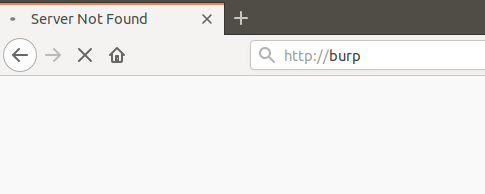
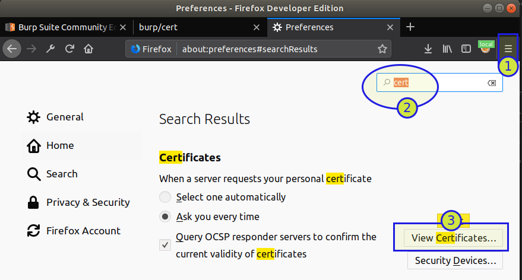
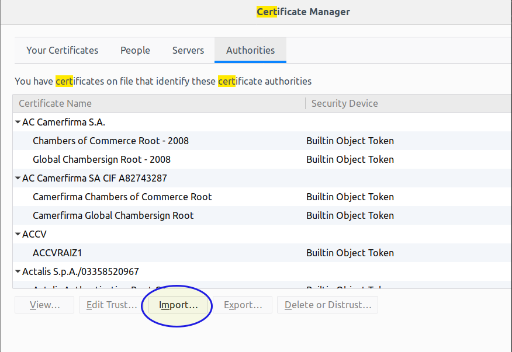
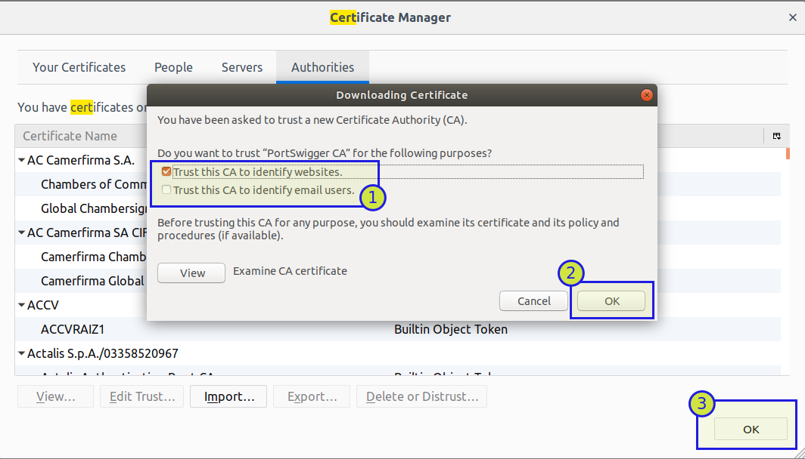

# Installing Burp's CA Certificate

[< Back](../README.md)

At this point, even though you could intercept most of the HTTP traffic, you might face issues while trying to access secure websites, i.e., websites that follow the "__HTTPS__" protocol. To resolve this issue, you must [install Burp's CA Certificate](https://support.portswigger.net/customer/portal/articles/1783075-installing-burp-s-ca-certificate-in-your-browser) in your Firefox browser.

1. Go to __Burp__ > __Proxy__ > __Intercept__ and disable intercept mode by clicking on the "__Intercept is on__" button.

    
    
    ---

2. Navigate to `http://burp` in your Firefox browser.

    
    ---

3. Click on "CA Certificate" to download the "cacert.der" certificate for Burp.

    
    ---

4. In your running instance of the Firefox browser, go to "Preferences", search for the term "certificates", and click on "View Certificates" button.

    
    ---

5. In the "Certificate Manager" window, click on "Import" button and select the downloaded "cacert.der" file.

    
    ---

6. In the "Downloading Certificate" window prompt, select checkboxes as shown in following image and click on "Ok".

    
    ---

7. Validate if you could access secure websites in proxy mode without any error, by accessing "https://www.google.com" in the Firefox browser with proxy mode enabled.

    
    ---

[< Back](../README.md)