# Setting up Burp Suite to work with Security Shepherd

[< Back](../README.md)

## Checkpost-1: Setting up the Target

1. Open '__Oracle VM VirtualBox Manager__'.
2. From the top-left `File` menu, select `Import Appliance` option.

    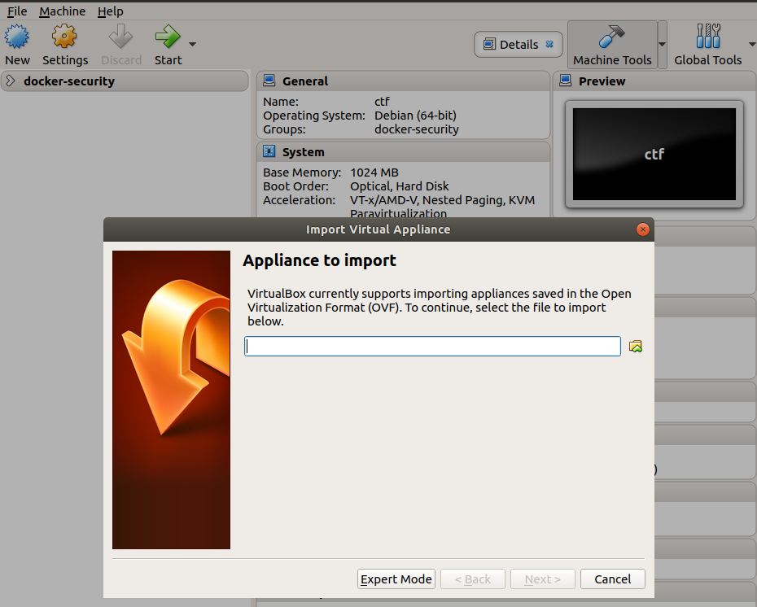
    ---

3. Select the OVA file `OwaspSecurityShepherdVm_V3.0.ova` to import.

    
    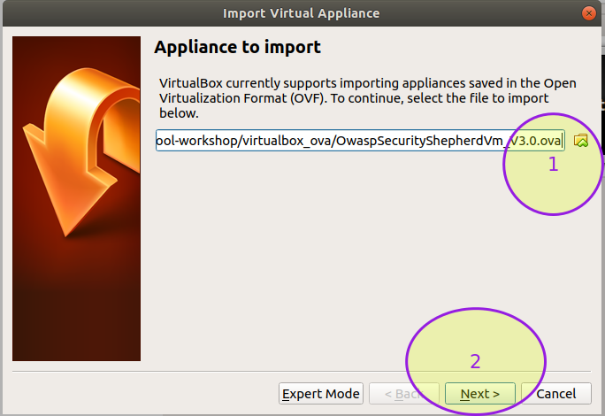
    ---

4. Click on `Import` button.

    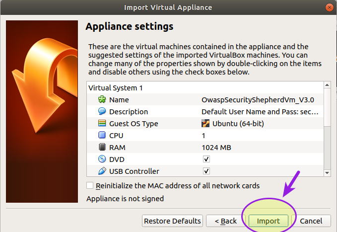
    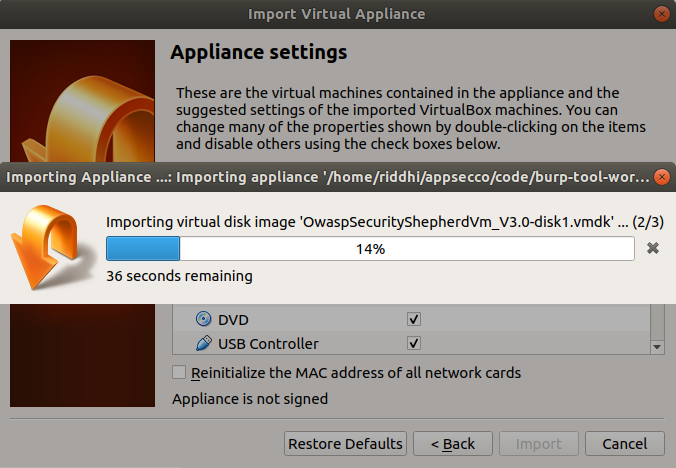
    ---

5. Select the imported appliance and click on `Start` button.

    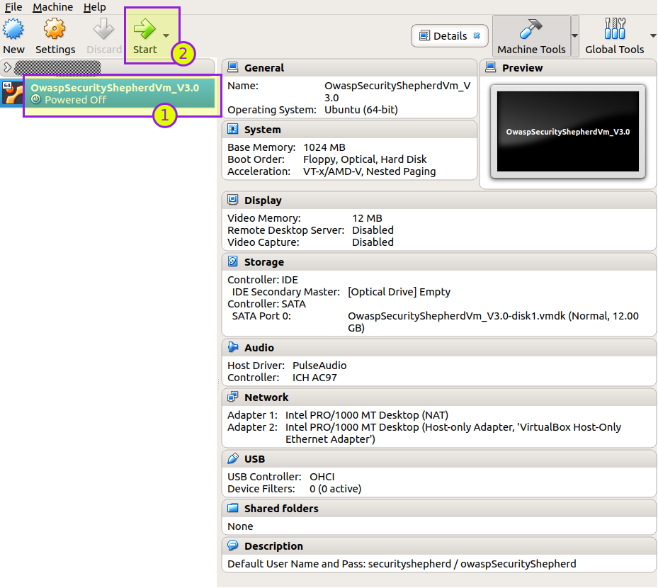
    ---

6. Did you encounter an error? If you did, click on `Change Network Settings` button, in the error prompt.

    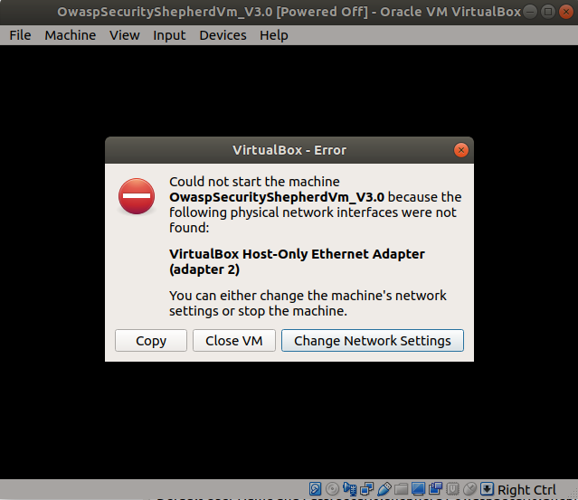
    ---

7. Ensure that `Adapter 1` settings are set as shown in following image, and then click on `OK` button.

    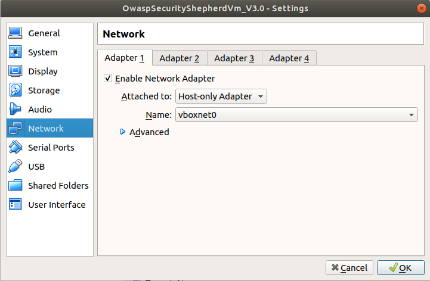
    ---

8. On the login prompt, enter credentials as mentioned in `Settings` > `General` > `Description`

    
    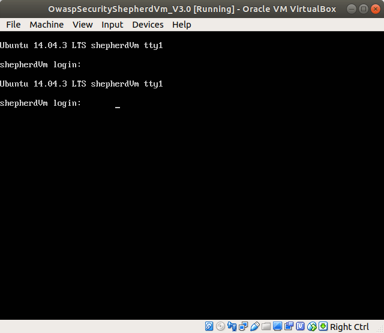
    ---

9. Did you reach here successfully?

    
    ---

10. Obtain IP address of target machine by running the command `ipconfig`. Do you see an IP that looks similar to: `192.168.56.101`?

    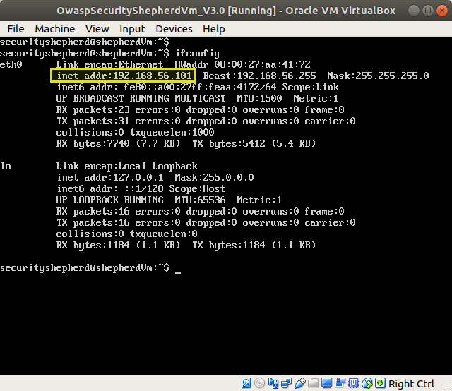
    ---
    
---

## Checkpost-2: Setting up FoxyProxy Addon

1. Check if you have __Firefox browser__ (https://www.mozilla.org/en-US/firefox/new/) installed in your machine.
2. Did you install the __FoxyProxy__ Standard add-on (https://addons.mozilla.org/en-US/firefox/addon/foxyproxy-standard/)? If you did already, skip to step #3.

    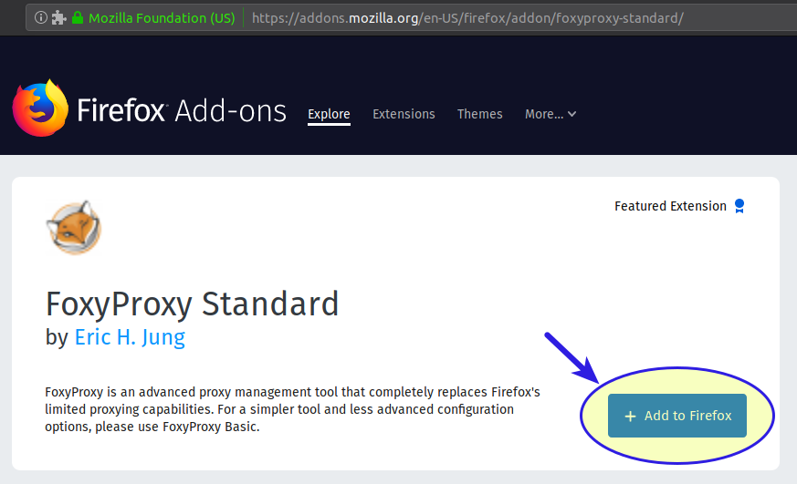
    
    
    ---

3. Open the Firefox browser.
4. Click on `FoxyProxy` icon in the top-right corner of your browser.
5. Select `Options` from the dropdown menu. 
6. Click on `Add` button to add a new __proxy__.

    
    ---

7. Enter title as `localhost-8080` (or anything of your choice), IP address as `127.0.0.1`, port as `8080`, and click on the `Save` button.

    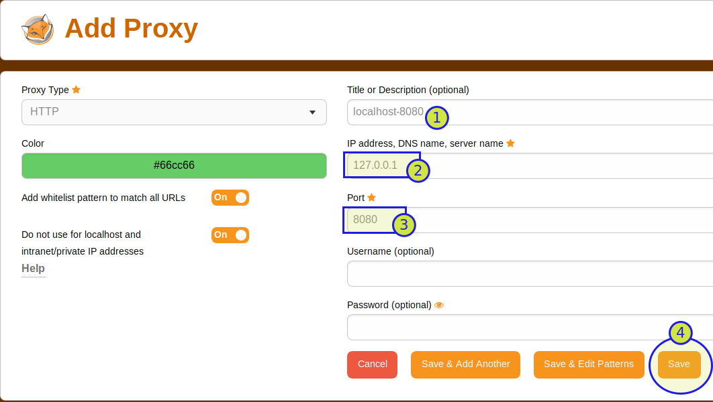
    
    ---

8. Enable proxy settings by selecting the option "__Use proxy localhost-8080 for all URLs (ignore patterns)__".

    
    ---
    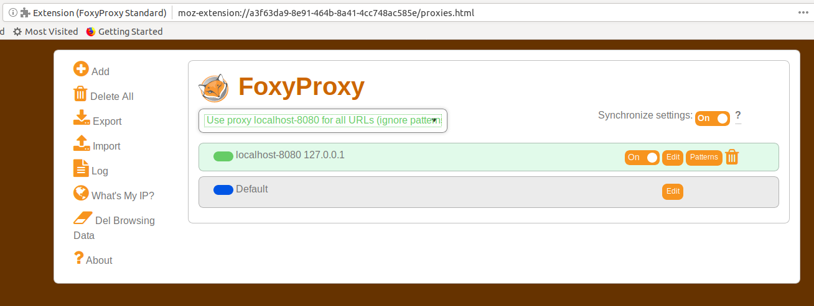
    ---

## Checkpost-3: Start Burping

1. If you have __Burp Suite__ Community Edition (https://portswigger.net/burp/communitydownload) already installed in your machine, start it now. [Else, download and install Burp Suite in your system first.]

    
    

2. Go to '__Proxy__' tab > '__Options__' sub-tab > '__Proxy Listeners__' section, and validate the proxy listener settings. It should be same as that set in the Firefox browser, i.e., enable a proxy listener for localhost (`127.0.0.1`) on port `8080`.

    
    ---

3. Switch to your Firefox browser and navigate to https://www.google.com
 
    
    ---

4. By now, you should see all your browser (Firefox) traffic going through Burp.

    
    ---

## Checkpost-4: Get rid of unnecessary browser traffic

1. Do you see unnecessary traffic in your site map? Are they originating from Firefox browser itself? We need to get rid of these noise. 

    
    ---
    
2. To disable capturing of unnecessary browser traffic, analyze the traffic in the "Site map" and identify URL patterns that need to be excluded. In the current scenario, we observe that most of the noise is originating from following two domains:
    * `firefox.com`
    * `mozilla.com`

3. In your Firefox browser, click on "FoxyProxy" icon and select "__Options__"

    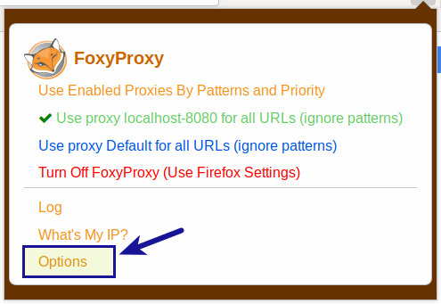
    ---

4. Choose the recently created proxy (named as, "localhost-8080") and click on "__Patterns__" button.

    
    ---

5. In the "Add/Edit Patterns for localhost-8080" window, click on "__New Black__" button, and edit the "Name" and "Pattern" fields as shown below:
    * __1st Black Pattern__:
        * Name: `firefox.com`
        * Pattern: `*.firefox.com`
    * __2nd Black Pattern__:
        * Name: `mozilla.com`
        * Pattern: `*.mozilla.com`

    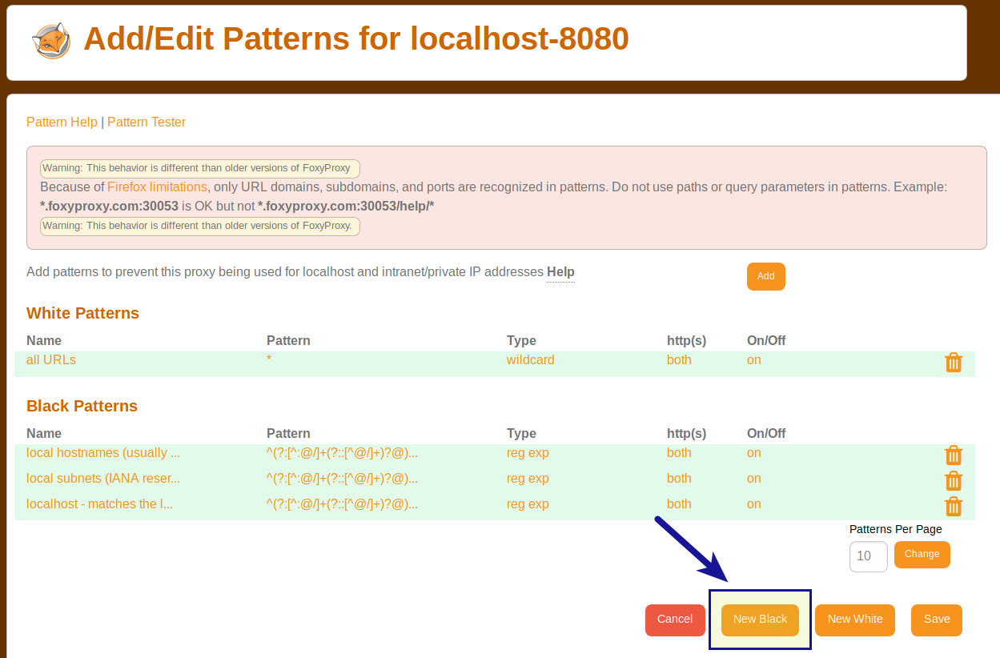
    ---
    
    ---

6. Delete the other (default) patterns listed under "Black Patterns". The final screen should look similar to:

    

7. Click on "Save" button and select the option "__Use Enabled Proxies By Patterns and Priority__".

    
    ---
    
    ---

## Checkpost-5: Installing SSL Certificate

At this point, even though you could intercept most of the HTTP traffic, you might face issues while trying to access secure websites, i.e., websites that follow the "__HTTPS__" protocol. To resolve this issue, you must install _Burp's CA Certificate_ in your Firefox browser.

1. Go to __Burp__ > __Proxy__ > __Intercept__ and disable intercept mode by clicking on the "__Intercept is on__" button.

    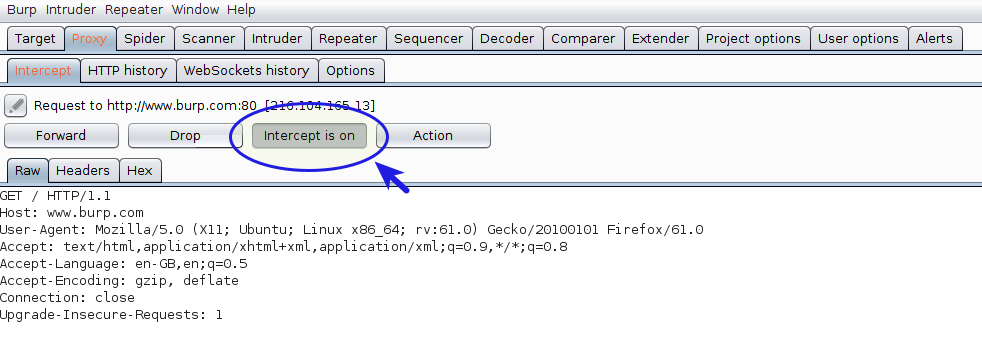
    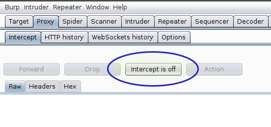
    ---

2. Navigate to `http://burp` in your Firefox browser.

    
    ---

3. Click on "CA Certificate" to download the "cacert.der" certificate for Burp.

    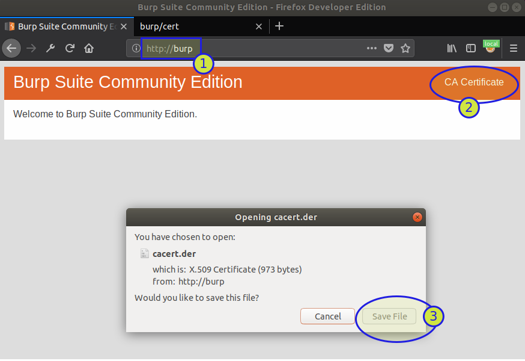
    ---

4. In your running instance of the Firefox browser, go to "Preferences", search for the term "certificates", and click on "View Certificates" button.

    
    ---

5. In the "Certificate Manager" window, click on "Import" button and select the downloaded "cacert.der" file.

    
    ---

6. In the "Downloading Certificate" window prompt, select checkboxes as shown in following image and click on "Ok".

    
    ---

7. Validate if you could access secure websites in proxy mode without any error, by accessing "https://www.google.com" in the Firefox browser with proxy mode enabled.

    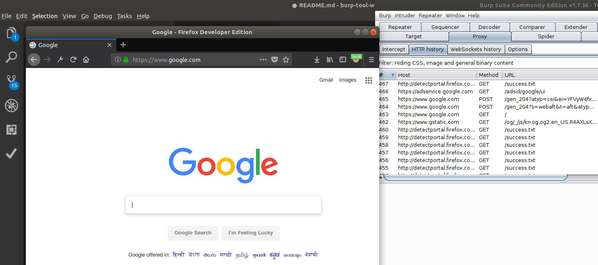
    ---

## Checkpost-6: Access your target through Burp Suite

1. Change the URL in your Firefox browser to the IP address of your target application, i.e., enter `192.168.56.101` in the URL address bar and hit ENTER.

    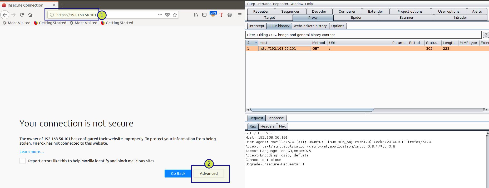
    ---

2. If you have encountered an insecure connection error, that says "_The owner of 192.168.56.101 has configured their website improperly. ..._", then click on "__Advanced__" > "__Add Exception__"

    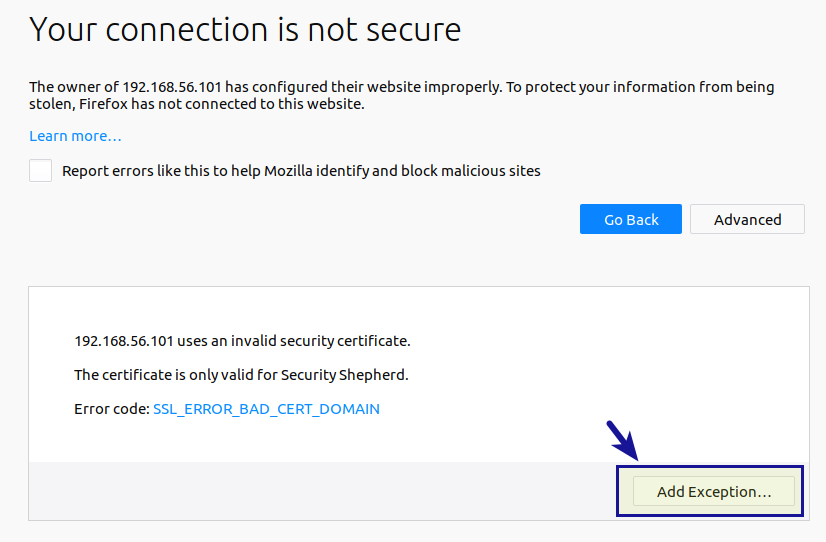
    ---

3. Uncheck the checkbox that says "_Permanently store this exception_", and click on "__Confirm Security Exception__" button.

    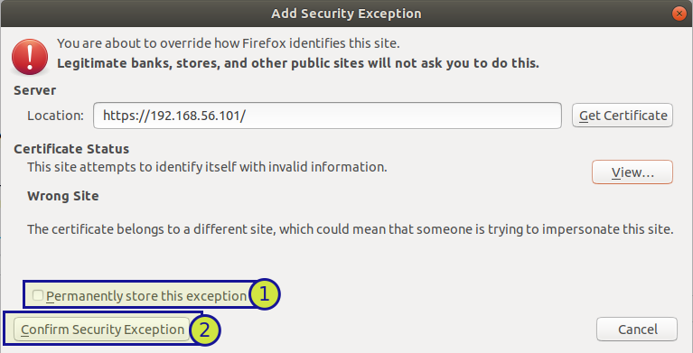
    ---

4. Did you meet the __Security Shepherd__? Let's get some secrets out...

    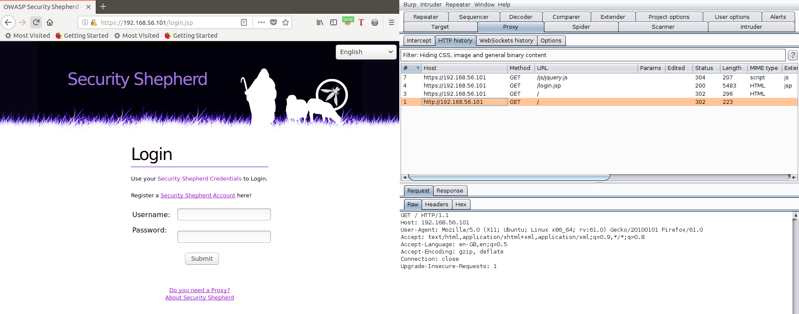
    ---
---

[< Back](../README.md)