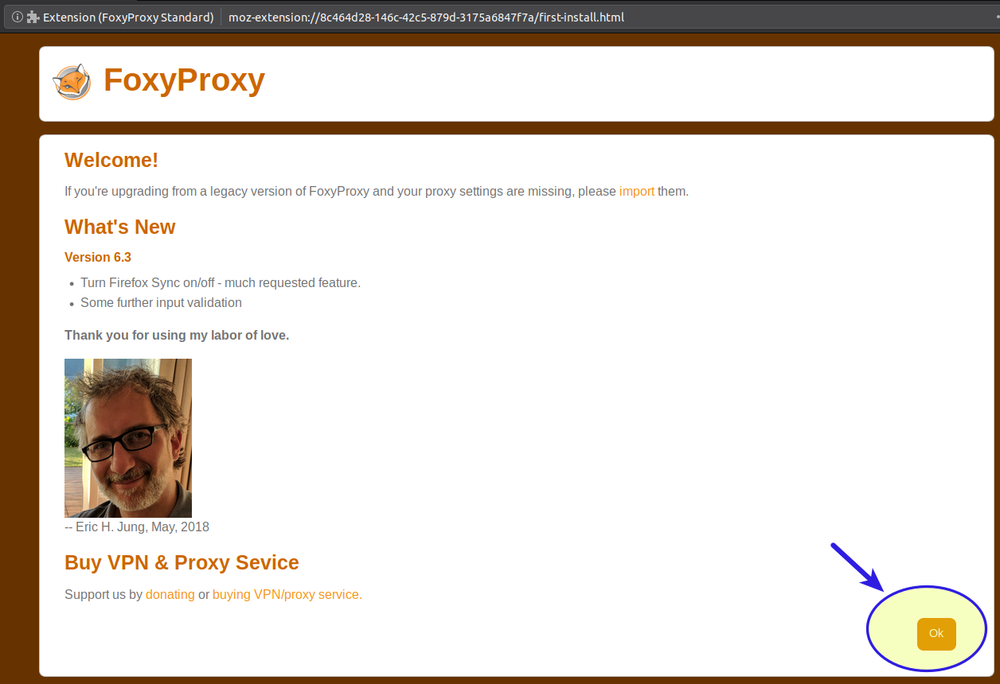
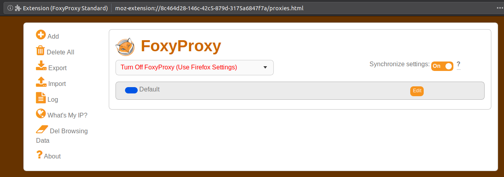
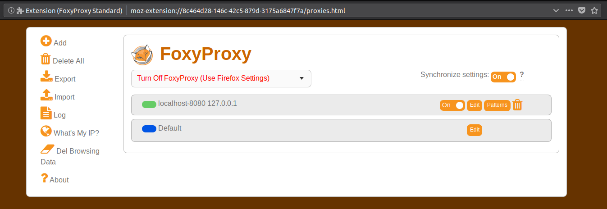

# Setting Up FoxyProxy Addon

[< Back](../README.md)

1. Check if you have __Firefox browser__ (https://www.mozilla.org/en-US/firefox/new/) installed in your machine.
2. Did you install the __FoxyProxy__ Standard add-on (https://addons.mozilla.org/en-US/firefox/addon/foxyproxy-standard/)? If you did already, skip to step #3.

    
    
    
    ---

3. Open the Firefox browser.
4. Click on `FoxyProxy` icon in the top-right corner of your browser.
5. Select `Options` from the dropdown menu. 
6. Click on `Add` button to add a new __proxy__.

    
    ---

7. Enter title as `localhost-8080` (or anything of your choice), IP address as `127.0.0.1`, port as `8080`, and click on the `Save` button.

    
    
    ---

8. Enable proxy settings by selecting the option "__Use proxy localhost-8080 for all URLs (ignore patterns)__".

    
    ---
    
    ---

[< Back](../README.md)